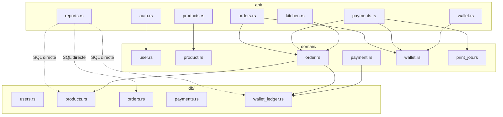

# Architecture Spine — MboaCaisse

## Design Paradigm

**Layered + Rich Domain.**

```
Frontend (Nuxt 4 / Vue 3)
  │  HTTP (LAN, <10ms)
  ▼
api/  (peau fine : parse → appelle domain → sérialise)
  │
  ▼
domain/  (comportement métier, traits repository, DomainError enum)
  │
  ▼
db/  (repositories impl, rusqlite, r2d2 pool, refinery migrations)
```

- `domain/` contient le comportement, pas des structs anémiques. Un `Order` a une méthode `pay()` qui vérifie le solde, appelle le ledger, change le statut.
- `api/` est une peau fine : parse la requête, appelle le domaine via `Arc<dyn XxxRepository>`, sérialise la réponse.
- `db/` implémente les traits définis dans `domain/`. DbError ne sort jamais de cette couche.
- Pas d'hexagonal : boilerplate injustifié pour équipe 1-2 devs, infra stable (Axum, SQLite, USB), risque = logique métier, pas changement d'infra.

## Invariants & Rules



### AD-1 — Paradigme Layered + Rich Domain

- **Binds:** `all`
- **Prevents:** Domain anémique (structs sans méthodes), hexagonal boilerplate, dépendances remontant de db/ vers api/
- **Rule:** `domain/` contient le comportement métier. Les méthodes d'aggregat prennent `dyn Repository` en paramètre. `api/` ne contient pas de logique. `db/` implémente les traits.

### AD-2 — Append-only financier (pattern système)

- **Binds:** `wallet`, futures `factures`, `commissions`, `payroll`
- **Prevents:** UPDATE/DELETE sur données financières, perte de traçabilité, race condition sur solde concurrent
- **Rule:** Toute table à valeur financière est INSERT-only. `wallet_ledger` = append-only, backup toutes les 5 min. Pattern s'étend à toute nouvelle feature financière. **Tout calcul de solde (SELECT SUM) + INSERT est fait dans une même transaction SQL (BEGIN → SELECT → INSERT → COMMIT).** Jamais de read-then-write en deux requêtes séparées.

### AD-3 — Structure plate par couche

- **Binds:** `all`
- **Prevents:** Arborescence profonde (navigation lente pour petite équipe)
- **Rule:** Fichiers directement dans `api/`, `domain/`, `db/`. Pas de sous-dossiers par module. Profondeur ajoutée quand >15 fichiers par dossier.

### AD-4 — Payment et Wallet séparés

- **Binds:** `payment`, `wallet`
- **Prevents:** Fusion du compte client et de l'acte d'encaissement
- **Rule:** Wallet = comptes + ledger + identification téléphone. Payment = encaissement + multi-moyen + validation + écriture ledger. Payment appelle Wallet. Wallet n'appelle jamais Payment.

### AD-5 — Print = service transverse

- **Binds:** `payment`
- **Prevents:** Logique d'impression dispersée dans api/domain/db
- **Rule:** `src/print.rs`. File d'attente asynchrone + writer ESC/POS. Appelé par Payment. Ne bloque jamais la commande.

### AD-6 — Reports = lecture seule

- **Binds:** `reports`
- **Prevents:** Duplication logique métier dans les rapports
- **Rule:** `api/reports.rs`. Queries SQL directes sur toutes les tables. Retourne DTOs de présentation. Pas de fichier dans `domain/` pour les rapports.

### AD-7 — Traits repository dans domain

- **Binds:** `all`
- **Prevents:** Fuite de dépendance db/ vers domain/ (ex: SQLx importé dans une struct métier)
- **Rule:** `domain/` définit `trait XxxRepository { ... }`. `db/` implémente. `api/` prend `Arc<dyn XxxRepository>`.

### AD-8 — Erreurs 3 couches sans fuite

- **Binds:** `all`
- **Prevents:** Erreur SQL qui remonte à l'API, perte de contexte métier
- **Rule:**
  - `db/` → `Result<T, DbError>` (interne, ne sort pas)
  - `domain/` → `Result<T, DomainError>` (enum: InsufficientBalance, ProductNotFound, InvalidStatusTransition, DuplicatePhone, ...)
  - `api/` → `(StatusCode, Json<ApiError>)` avec `{"error": "...", "code": "..."}`. Status code = HTTP standard (200/201/400/401/403/422/500). Pas d'enveloppe `{ok}` générique.

### AD-9 — Cycle de vie Tauri → Axum → backup

- **Binds:** `lib.rs`, `main.rs`
- **Prevents:** Corruption BDD à la fermeture, requêtes en vol perdues brutalement
- **Rule:** `on_event(ExitRequested)` → shutdown_tx → Axum graceful shutdown → backup BDD. Timeout 5s sur le backup. Mieux vaut perdre un backup qu'une corruption.

### AD-10 — Stack alpha

- **Binds:** `all`
- **Prevents:** Sur-ingénierie, dépendances instables
- **Rule:** Rust edition 2021. Tokio/Axum versions flottantes (lockfile gèle). rusqlite + r2d2. refinery migrations. TanStack Query supprimé (useFetch() Nuxt suffit en LAN <10ms). Pas de WebSocket en V1. Nuxt 4 / Vue 3 / Pinia / TailwindCSS v4.

### AD-11 — Auth JWT + rôles

- **Binds:** `auth`
- **Prevents:** Sessions non standard, refresh token complexe
- **Rule:** Cookie `mboa_session`. JWT 24h. Refresh silencieux si <1h restante. Argon2. 4 rôles avec permissions granulaires `Vec<Permission>`. Seed idempotent au premier démarrage (admin + 10 produits / 3 catégories).

### AD-12 — Config via Tauri store

- **Binds:** `all`
- **Prevents:** Fragmentation config (YAML + env + store), fichiers externes non gérés
- **Rule:** `tauri_plugin_store` dans `$APP_DATA_DIR` pour port (3000), mDNS hostname (mboacaisse), backup interval (24h), stock bas seuil (5), moyens paiement (['cash']). Pas de YAML/TOML.

### AD-13 — Graphe dépendances

- **Binds:** `all`
- **Prevents:** Dépendances circulaires, couplage non maîtrisé
- **Rule:** Voir diagramme ci-dessus. Wallet est une île (pas de dépendance sortante). Auth indépendant. Payment → Order+Wallet+Print. Order → Catalog+Wallet. Kitchen → Order (lecture statut). Stock → Catalog (lecture produits, conso en P2). Reports → SQL directe.

### AD-14 — Kitchen display polling

- **Binds:** `kitchen`
- **Prevents:** Complexité WebSocket en V1
- **Rule:** Polling HTTP 5s via `useFetch()` + `setInterval`. Pas de connexion persistante. P2.7 si besoin confirmé.

### AD-15 — Migrations refinery

- **Binds:** `db/`
- **Prevents:** Schema non versionné, mise-à-jour manuelle
- **Rule:** `refinery::Runner::new().run()` au startup. SQL embarquées, table `_schema_version` auto-gérée. Échec → log + exit. Pas de démarrage serveur sans schéma validé.

### AD-16 — Pool r2d2-rusqlite

- **Binds:** `db/`
- **Prevents:** Panne pool non mature en alpha
- **Rule:** r2d2-rusqlite. Switch deadpool-sqlite si obsolescence.

### AD-17 — Déploiement alpha

- **Binds:** `build`, `deploy`
- **Prevents:** Sur-ingénierie CI/CD, staging inutile
- **Rule:** Pas de staging. Binaire unique. Dev = poste développeur, Prod = PC commerçant. Licence alpha pré-générée = flag alpha dans entitlements = logs DEBUG + diagnostics activés.

### AD-18 — Logs tracing

- **Binds:** `all`
- **Prevents:** Logs bruités en prod, silence gênant en debug
- **Rule:** `tracing` + `tracing-subscriber`. Niveau INFO par défaut, DEBUG si licence alpha. Fichier `mboacaisse.log` dans `$APP_DATA_DIR`. Pas de rolling en alpha.

## Consistency Conventions

| Concern | Convention |
|---|---|
| Nommage fichiers | `snake_case.rs` — un fichier par capacité dans chaque couche |
| Identifiants | UUID v7 pour toutes les entités (ordonnés temporellement, indexables) |
| Dates | ISO 8601 en UTC. Stocké en TEXT SQLite. Jamais de timestamp UNIX |
| Erreurs API | `{"error": "...", "code": "SCREAMING_SNAKE"}` — code = nom du variant DomainError |
| Erreurs domaine | Enum `DomainError` avec cas nommés, pas de `anyhow` dans domain/ |
| Mutation data | Append-only pour données financières. UPDATE autorisé pour data non-financière |
| Wallet | `wallet_ledger` INSERT-only. `wallet_clients` UPDATE pour email/phone |
| Dépendances | Wallet ne dépend de rien. Payment → Wallet. Order → Catalog + Wallet |
| Frontend API | `useFetch('/api/...', { server: false })`. Pas de TanStack Query. Pas de WebSocket |
| Config store | `tauri_plugin_store`. Chargé au startup. Accessible Rust + frontend (via Pinia bridge) |

## Stack

| Name | Version / Résolution |
|---|---|
| Rust edition | 2021 |
| Tokio | 1 (flottant, lockfile gèle) |
| Axum | 0.8 (flottant) |
| rusqlite | dernière stable |
| r2d2-rusqlite | dernière stable |
| refinery | dernière stable |
| tracing | dernière stable |
| argon2 | dernière stable |
| Nuxt | 4 |
| Vue | 3 |
| Pinia | dernière stable |
| TailwindCSS | v4 |
| mdns-sd | dernière stable |
| tauri-plugin-store | dernière stable |

## Structural Seed

```text
src-tauri/src/
├── main.rs              # Entry Tauri, on_event ExitRequested
├── lib.rs               # Builder Tauri, plugins registration
├── server.rs            # Axum serve + graceful shutdown handle
├── mdns.rs              # Publication mDNS (mboacaisse.local)
├── print.rs             # Service impression asynchrone (ESC/POS)
├── api/
│   ├── mod.rs           # Router Axum + middleware auth
│   ├── auth.rs          # Login, logout, refresh JWT
│   ├── products.rs      # CRUD catalogue
│   ├── orders.rs        # Cycle commande (création → validation → cuisine)
│   ├── payments.rs      # Encaissement multi-moyen
│   ├── wallet.rs        # Solde, ledger, identification client
│   ├── kitchen.rs       # Affichage cuisine (lecture commandes actives)
│   ├── reports.rs       # Rapports agrégés (SQL direct)
│   ├── health.rs        # GET /api/health diagnostic
│   └── settings.rs      # Configuration store
├── domain/
│   ├── mod.rs
│   ├── user.rs          # User, Role, Permission, trait UserRepository
│   ├── product.rs       # Product, Category, trait ProductRepository
│   ├── order.rs         # Order, OrderStatus, trait OrderRepository
│   ├── payment.rs       # Payment, PaymentMethod, trait PaymentRepository
│   ├── wallet.rs        # WalletClient, WalletLedgerEntry, trait WalletRepository
│   └── print_job.rs     # PrintJob struct (pas de repository)
├── db/
│   ├── mod.rs
│   ├── migrations.rs    # Runner refinery + SQL embarquées
│   ├── seed.rs          # Seed idempotent admin + produits démo
│   ├── users.rs         # impl UserRepository pour rusqlite
│   ├── products.rs      # impl ProductRepository
│   ├── orders.rs        # impl OrderRepository
│   ├── payments.rs      # impl PaymentRepository
│   └── wallet_ledger.rs # impl WalletRepository
```

## Capability → Architecture Map

| Capabilité | Vit dans | Gouverné par |
|---|---|---|
| Auth | api/auth.rs, domain/user.rs, db/users.rs | AD-11 (JWT cookie, argon2, 4 rôles) |
| Catalog | api/products.rs, domain/product.rs, db/products.rs | AD-13 (indépendant) |
| Order | api/orders.rs, domain/order.rs, db/orders.rs | AD-13 (→Catalog, →Wallet) |
| Payment | api/payments.rs, domain/payment.rs, db/payments.rs | AD-4 (→Order, →Wallet, →Print) |
| Wallet | api/wallet.rs, domain/wallet.rs, db/wallet_ledger.rs | AD-2 (append-only), AD-4 (île) |
| Kitchen | api/kitchen.rs, domain/order.rs (lecture) | AD-14 (polling 5s) |
| Stock | api/stock.rs, domain/product.rs, db/products.rs | AD-13 (→Catalog; conso en P2) |
| Reports | api/reports.rs | AD-6 (SQL directe, pas de domain) |
| Print | src/print.rs | AD-5 (service transverse, file async) |
| Config | api/settings.rs, tauri_plugin_store | AD-12 (store Tauri, pas YAML) |

## Deferred

| Décision | Raison | Revisit |
|---|---|---|
| WebSocket serveur (P2.7) | V1 = polling HTTP, WebSocket non nécessaire | Si besoin temps réel confirmé |
| Tauri updater (P2.4) | Trop lourd pour 3 alpha. Remplacement binaire suffit | Passage 1→10 établissements |
| Impression ESC/POS (P2.1) | V1 = ticket numérique ou impression générique | Quand client demande imprimante |
| Licence platform (P4) | Système cloud séparé, pas d'impact archi alpha | Lancement commercial |
| Bundles commerciaux | Feature gating via licence (Ed25519). Architecture = même binaire | Quand >1 bundle à vendre |
| Migration Rust 2024 | Frictions potentielles avec crates Tauri | P2+ si justifié |
| Conso stock auto | Stock → Order prévu en P2 | Après alpha |
| JavaScript frontend | Organisation par feature si >15 fichiers/dossier | Quand croissance atteint seuil |
| Log rolling | Pas nécessaire en alpha | Pré-prod |
